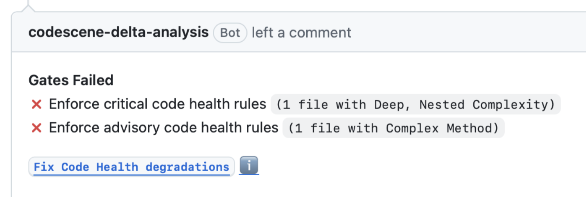

# CodeScene PR Refactoring Agent

> **Note**: This project is under active development and not yet ready for use.

This repository contains the instructions and templates for enabling CodeScene's PR Refactoring Agent.

The PR Refactoring Agent lets reviewers trigger Code Health-guided refactoring directly from pull requests. It keeps refactoring inside the normal review flow while giving teams a consistent way to improve maintainability and prevent regressions.

## Features

- 🔍 **Automatic code health analysis** - Identifies technical debt and code smells
- 🤖 **AI-guided refactoring** - Uses state-of-the-art LLMs to suggest and apply improvements
- 📊 **CodeScene integration** - Leverages CodeScene's battle-tested code health metrics
- 🔄 **PR-driven workflow** - Trigger refactorings directly from pull request comments
- 🎯 **Skill-based execution** - Pre-built refactoring skills for common scenarios

## Quick Start

1. Configure your repository secrets for CodeScene and at least one supported AI provider.
2. Add the workflow below to your repository.
3. Run the refactoring agent by clicking the fix button in the pull request.

## Required: Configure repository secrets

Add these secrets to your repository (Settings → Secrets and variables → Actions):

- `CODESCENE_ACCESS_TOKEN` - Get it using the option that matches your setup:
  - CodeScene Cloud PAT: create it at [Create a Personal Access Token](https://codescene.io/users/me/pat).
  - CodeScene on-prem PAT: log in to your CodeScene instance, open `Configuration`, go to `Authentication`, then create a token under `Personal Access Tokens`. You can also go directly to `https://<your-cs-host><:port>/configuration/user/token`.

**At least one AI provider:**
- `ANTHROPIC_API_KEY` - Get from [Anthropic](https://console.anthropic.com)
- `OPENAI_API_KEY` - Get from [OpenAI](https://platform.openai.com)
- `GOOGLE_API_KEY` - Get from [Google AI Studio](https://aistudio.google.com)



_Example of how the pull request fix button looks when the refactoring agent is available._

### Required: add the agent workflow to GitHub

Add this workflow to your repository at `.github/workflows/refactoring-agent.yml`:

```yaml
name: PR Refactoring Agent

on:
  issue_comment:
    types: [created]

jobs:
  refactor:
    # Only run on PR comments that start with /cs-agent
    if: github.event.issue.pull_request != null && contains(github.event.comment.body, '/cs-agent')
    runs-on: ubuntu-latest
    permissions:
      contents: write
      pull-requests: write
      issues: write
    steps:
      - uses: codescene-oss/pr-refactoring-agent@v1
        with:
          pr_number: ${{ github.event.issue.number }}
          command: ${{ github.event.comment.body }}
          push: true
          codescene_token: ${{ secrets.CODESCENE_ACCESS_TOKEN }}
          anthropic_api_key: ${{ secrets.ANTHROPIC_API_KEY }}
```

Then comment `/cs-agent` on any pull request to trigger the agent.

The action automatically:
- Fetches PR metadata
- Checks out the PR branch
- Configures git
- Runs the refactoring
- Pushes changes (if `push: true`)
- Posts a comment with the result

## 💡 The quality of the agent depends on the model

The refactoring quality of the agent depends heavily on the strength of the backing LLM, so use one of the strongest available models from a supported provider.

The refactoring agent supports models from Anthropic, OpenAI, and Google.

## Available Skills

The agent includes two pre-built refactoring skills:

- `skill:fix-code-health-degradations` - Fix only the Code Health regressions introduced by the PR, without touching pre-existing debt
- `skill:uplift-code-health` - Raise Code Health for selected files toward a target score, in measurable incremental steps

## Inputs

| Input | Description | Required | Default |
|-------|-------------|----------|---------|
| `command` | The refactoring command to execute | Yes | - |
| `codescene_token` | CodeScene API access token | Yes | - |
| `model` | AI model to use | Yes | - |
| `pr_number` | Pull request number (triggers PR checkout and comment) | No | - |
| `version` | Version of the agent to use | No | `latest` |
| `create_branch` | Create a new branch before refactoring | No | - |
| `push` | Push changes to remote after refactoring | No | `false` |
| `remote` | Git remote name | No | `origin` |
| `github_token` | GitHub token for authentication | No | `${{ github.token }}` |
| `anthropic_api_key` | Anthropic API key | No | - |
| `openai_api_key` | OpenAI API key | No | - |
| `google_api_key` | Google API key | No | - |
| `opencode_auth_json` | OpenCode auth JSON | No | - |

## Example Workflows

### Trigger on PR Comment

```yaml
name: PR Refactoring

on:
  issue_comment:
    types: [created]

jobs:
  refactor:
    if: github.event.issue.pull_request != null && contains(github.event.comment.body, '/cs-agent')
    runs-on: ubuntu-latest
    permissions:
      contents: write
      pull-requests: write
      issues: write
    steps:
      - uses: codescene-oss/pr-refactoring-agent@v1
        with:
          pr_number: ${{ github.event.issue.number }}
          command: ${{ github.event.comment.body }}
          push: true
          codescene_token: ${{ secrets.CODESCENE_ACCESS_TOKEN }}
          anthropic_api_key: ${{ secrets.ANTHROPIC_API_KEY }}
```


## Platform Support

The action supports Linux runners (amd64, aarch64).

## How It Works

1. **Download**: The action downloads the appropriate pre-built binary for your platform
2. **Analyze**: CodeScene analyzes your code for health issues and technical debt
3. **Refactor**: The AI model generates and applies improvements based on CodeScene's guidance
4. **Commit**: Changes are automatically committed (and optionally pushed) to your branch

## License

Copyright CodeScene AB. See [LICENSE](LICENSE) for terms.

## Support

- [GitHub Issues](https://github.com/codescene-oss/pr-refactoring-agent/issues)
- [Documentation](https://codescene.com/docs)
